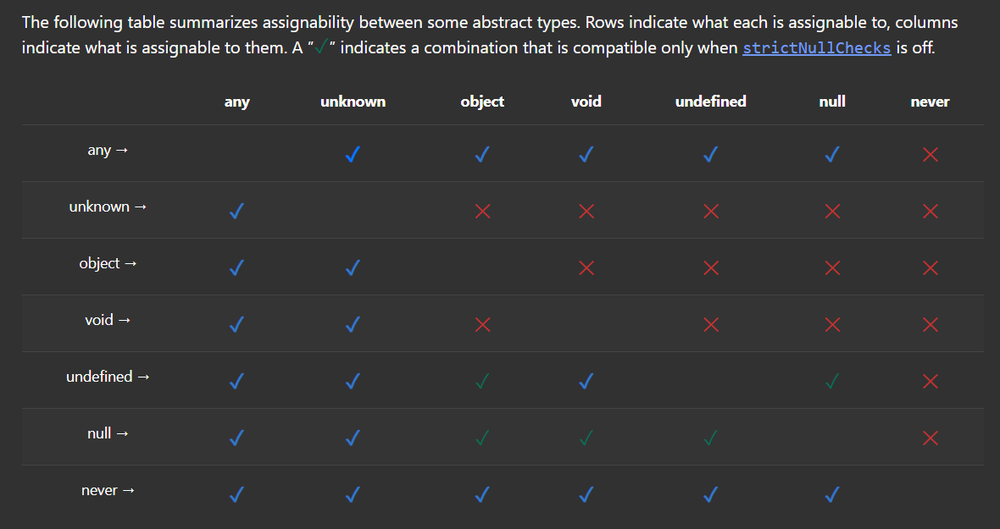

# typescript is a super set of js it helps us to write cleaner and less error js code

it gives us

1. type safety solves the error of ( string + Number ) problem
2. provide static checking ( checks for the error while writing the code )
3. Its a devlopment tool (our project still run in js)

# type script types

1. Number
2. String
3. Boolean
4. Null
5. Undefined
6. Void
7. Object
8. Array
9. Tuples
10. Any
11. Unknown
12. never

# for function there should be type annotation for variable its optional
